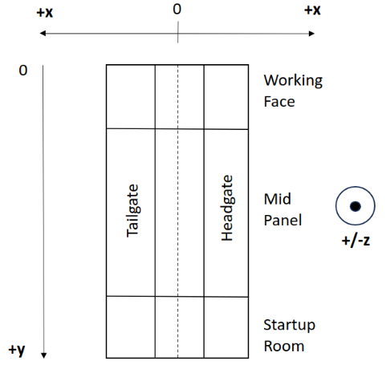

# gob

This project is a fork/extension of and complete frontend for an Ansys Fluent plugin based on the [PhD work](https://www.proquest.com/docview/1727469797?parentSessionId=dk%2B8XNGTmDGPKcxt8AIw%2Bj9AfFFP9pqKjUxW8XapYE8%3D) of Dr. Richard C. Gilmore at Colorado School of Mines. Dr. Gilmore's research focuses (in part) on performing a multiphase fluid simulation of the mixing of methane and oxygen within panels of gob created by underground longwall coal and trona mining, as well as analyzing the results to determine the likelyhood of an explosive mixture forming in the given mine. This can be useful when designing safe and effective methane ventilation systems for new mines, analyzing previous explosions, or proposing changes to existing ventilation systems.

## Dependencies

__Architecture__: Linux x86_64 or Windows x64 \
__C Compiler__: (If using Linux,) C99 compiler available on the system path (probably already the case; check using `$ cc -v`) \
__C++ Compiler__: A version of [g++](https://gcc.gnu.org/) supporting C++17 or newer available on the system path ([careful](https://stackoverflow.com/a/41379378) about this on Windows!) \
__Ansys Fluent__: Version 2023 R1 or newer ([software](https://www.ansys.com/products/fluids/ansys-fluent) + active license)

## Usage

1. Place all files from this repo in a directory alongside a valid mesh/case/data file(s) \
  a. This should be the working directory when you start Fluent
3. Load the mesh/case file into Fluent
4. Load the plugin; either \
  a. __GUI__: Load > Scheme > `gob_user_interface.scm` \
  b. __TUI__: `> (load "gob_user_interface.scm")`
5. Open the GUI by clicking the newly-created "Model Mine Gob" button in the Fluent ribbon menu
6. Set up simulation; in any order \
  a. __Required Settings__: Choose a mine type to model the simulation after (see more about what these mean in Dr. Gilmore's research), toggle explosive gas zone colorization, and enter mass fraction concentrations for methane and oxygen (be sure to click "Apply" whenever you change these values!) \
  b. __Optional Settings__: Enter whatever values you like (reasonable defaults are entered automatically) \
  c. __Zone Selection__: This is sort of a matching game; one at a time you must choose a zone type, match it to an actual zone in the loaded mesh from the provided list, and click "Select Zone" (if any zone is assigned to "Single Part Mesh", all other selections will be ignored and calculations will be done as a single-part mesh setup)
7. Click "OK"
8. Display desired contour graphs under Graphics > Contours

See below for how to use the color map selection menu.

## Limitations / Assumptions

### Mesh

- Must be 3D
- Can be a super-critical (9 zones) or sub-critical (6 zones) mine panel
- Can be partitioned into zones (working face, mid-panel, startup room, etc.) __or__ a single partition
  - For a single-part mesh, the startup room __must__ be at a more positive y-location than the working face (there is simply not enough information present in such a mesh to avoid this limitation)
- Zones names must contain the string "gob" in order to be filtered out of all the other non-gob-related zones

### Transformations

The equations assume a coordinate space like the one seen above for the mesh. From this location, the mesh may be transformed, though with some restrictions:

__Scaling__: Uniform scaling only \
__Rotation__: Interger multiples of &#960;, about the z-axis \
__Translation__: All translations permitted

In effect - mesh must be aligned with the axes such that the panel length lies along the y-axis and the panel width along the x-axis

## Future Work

- Allow for arbitrary mesh transformations by computing the complete transformation matrix for any given mesh
  - Would likely involve retrieving the 8 corner points of the panel and doing some relatively simple linear algebra
- Generalize the original VSI fitting equations to scale accurately to any given mine by reworking Dr. Gilmore's math (good luck :)
- Compile the code into a single binary that can be shipped with Fluent as an official add-in
  - Getting the tools to do this from Ansys proved more difficult and ... mysterious than expected
- There is a small bug where the contour graphs for porosity, permeability, and inertial resistance get cleared to zero before the user can view them (the numbers are obviously there at some point during the simulation, but then they're ... not)

## Colormap Selection

### Using This File

The file colormap_selection.scm can be used to easily select custom colormaps via a button box. \
Examples of the colormaps can be seen in the acknowledgements. \
 Make sure that the folder titled "colormaps" containing all of the .colormap files is in your working directory. \
The file colormap_selection.scm can also be put into the working directory. 

### Loading This File in Ansys Fluent
Option 1: Go to File>Read>Scheme...>colormap_selection.scm \
Option 2: Type the relative path into the console: (load "colormap_selection.scm") \
Option 3: Type the absolute path into the console: (load "C:/<file path>/colormap_selection.scm") \
Note: If this is done multiple times, the ribbon cannot be removed unless Ansys Fluent is restarted 

In the top ribbon menu, select the "Colormap Selection" tab and the dropdown to open the menu. \
Select your colormap and then click "OK" for it to apply. \
A command will automatically be applied and it can be seen in the console. 

To have a colormap selection apply to an existing model, a new contour must be created. 

To load this file automatically, the following command must be added to your .fluent file: \
(ti-menu-load-string "file read-journal colormap_selection.scm") 

### Using Ansys Fluent Predefined Colormaps
To see built in colormap options using the console: preferences/graphics/colormap-settings/colormap \
To change colormap: preferences/graphics/colormap-settings/colormap/<colormap> \
e.g. preferences/graphics/colormap-settings/colormap/field_velocity \
Use "q" or "quit" in the prompt to move back to the previously occupied menu, if needed. 

### Adding Ansys Fluent Predefined Colormaps to Selection Box
Step 1: Add this file to Fluent \
Option 1: Go to File>Read>Scheme...>colormap_selection.scm \
Option 2: Type the absolute path into the console: (load "C:/<path>/colormap_selection.scm" ) 

Step 2: In Ansys Fluent, change the currently selected colormap \
To see colormap options, type into the console: preferences/graphics/colormap-settings/colormap \
To select a colormap, type into the console: preferences/graphics/colormap-settings/colormap/<colormap> \
e.g. preferences/graphics/colormap-settings/colormap/field_velocity \
Use "q" or "quit" in the prompt to move back to the previously occupied menu, if needed 

Step 3: Save the colormap file to the colormaps folder \
Into the console, type: file/write-colormap colormaps/<file name>.colormap \
e.g. file/write-colormap colormaps/gray.colormap 

Step 4: Add button for colormap into this .scm file \
In the code below, there are 6 locations that must be edited. They can be searched for by finding "NEW COLORMAP" \
Uncomment these lines (comments start with semicolons) \
Replace what is inside the angle brackets (<>) with the appropriate names 

Step 5: Add this .scm file to Fluent again \
Option 1: Go to File>Read>Scheme...>colormap_selection.scm \
Option 2: Type the relative path into the console: (load "colormap_selection.scm") \
Option 3: Type the absolute path into the console: (load "C:/<path>/colormap_selection.scm") \
Note: The previous ribbon cannot be removed from Fluent unless Fluent is restarted

### Adding Downloaded Colormaps to Selection Box

Step 1: Add the .colormap file to the colormaps folder 

Step 2: Add button for colormap into this .scm file \
In the code below, there are 6 locations that must be edited. They can be searched for by finding "NEW COLORMAP" \
Uncomment these lines (comments start with semicolons) \
Replace what is inside the angle brackets (<>) with the appropriate names 

Step 3: Add this .scm file to Fluent again \
Option 1: Go to File>Read>Scheme...>colormap_selection.scm \
Option 2: Type the relative path into the console: (load "colormap_selection.scm") \
Option 3: Type the absolute path into the console: (load "C:/<path>/colormap_selection.scm") 

Note: The previous ribbon cannot be removed from Fluent unless Fluent is restarted 

### Acknowledgements 
The Scheme commands for reading and writing .colormap files along with custom colormaps 
were created/provided by James Wright and can be found here: 
https://github.com/jrwrigh/fluent_colormaps/tree/master 
